```
install.packages("ggridges")
install.packages("scales")
```


```r
library(tidyverse)
library(gapminder)
library(ggridges)
library(scales)
```


## Exercise 1: Overlapping Points

After fixing the error, fix the overlapping problem in the following plot (attribution: ["R for data science"](https://r4ds.had.co.nz/data-visualisation.html)).


```r
ggplot(mpg, aes(cty, hwy)) +
  geom_jitter(alpha = 0.5, size = 1) + #jitter adds visual difference to the data, makes it easier to understand, will change every time
  geom_smooth(method = 'lm') +
  theme_bw()
```

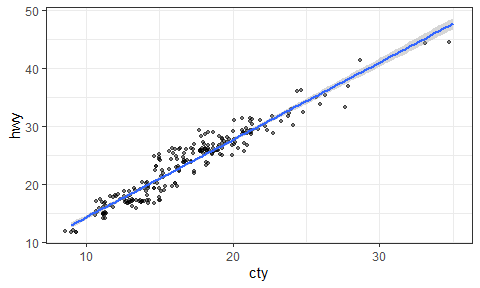<!-- -->


## Exercise 2: Line for each Country

Fix this plot so that it shows life expectancy over time _for each country_. Notice that `ggplot2` ignores the grouping of a tibble!


```r
gapminder %>% 
  ggplot(aes(year, lifeExp, group = country)) +
  geom_line(alpha = 0.2)
```

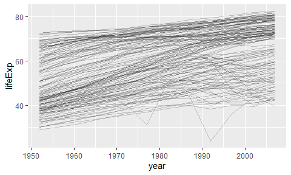<!-- -->


## Exercise 3: More gdpPercap vs lifeExp

### 3(a) Facets

- Change the x-axis text to be in "comma format" with `scales::comma_format()`.
- Separate each continent into sub-panels.


```r
ggplot(gapminder, aes(gdpPercap, lifeExp)) +
  geom_point(alpha = 0.2) +
  facet_wrap(~continent, scales = "free") +
  scale_x_log10(labels = scales::comma_format()) +
  theme_bw()
```

<!-- -->

### 3(b) Bubble Plot

- Put the plots in one row, and free up the axes.
- Make a bubble plot by making the size of the points proportional to population. 
  - Try adding a `scale_size_area()` layer too (could also try `scale_radius()`).
- Use `shape=21` to distinguish between `fill` (interior) and `colour` (exterior). 


```r
gapminder %>% 
  filter(continent != "Oceania") %>% 
  ggplot(aes(gdpPercap, lifeExp, size = pop, fill = continent)) +
  geom_point(alpha = 0.6, shape = 21) +
  facet_wrap(~ continent, nrow = 1) +
  scale_x_log10(labels = scales::comma_format()) +
  scale_size_area() +
  theme_bw()
```

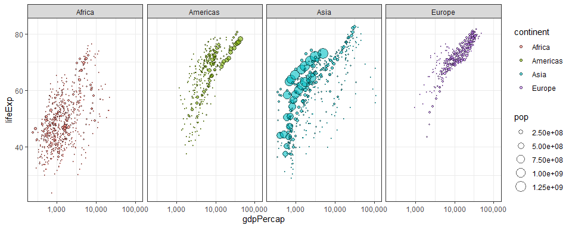<!-- -->

A list of shapes can be found [at the bottom of the `scale_shape` documentation](https://ggplot2.tidyverse.org/reference/scale_shape.html).

### 3(c) Size "not working"

Instead of alpha transparency, suppose you're wanting to fix the overplotting issue by plotting small points. Why is this not working? Fix it.


```r
ggplot(gapminder) +
  geom_point(aes(gdpPercap, lifeExp, size = 0.1)) +
  scale_x_log10(labels = scales::dollar_format())
```

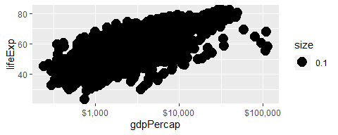<!-- -->


## Exercise 4: Walking caribou

The following mock data set marks the (x,y) position of a caribou at four time points. 

- Fix the plot below so that it shows the path of the caribou. 
- Add an arrow with `arrow = arrow()`.
- Add the `time` label with `geom_text()`.


```r
tribble(
  ~time, ~x, ~y,
  1, 0.3, 0.3,
  2, 0.8, 0.7,
  3, 0.5, 0.9,
  4, 0.4, 0.5
) %>% 
  ggplot(aes(x, y)) + 
  geom_line()
```

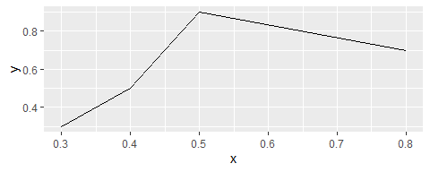<!-- -->

## Exercise 5: Life expectancies in Africa

### 5(a) Unhiding the data

Fix the plot so that you can actually see the data points. Be sure to solve the problem of overlapping text, without rotating the text.


```r
gapminder %>% 
  filter(continent == "Americas") %>% 
  ggplot(aes(country, lifeExp)) + 
  geom_point() +
  geom_boxplot()
```

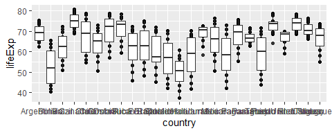<!-- -->

### 5(b) Ridgeplots

We're starting with the same plot as above, but instead of the points + boxplot, try a ridge plot instead using `ggridges::geom_density_ridges()`, and adjust the `bandwidth`.


```r
gapminder %>% 
  filter(continent == "Americas") %>% 
  ggplot(aes(country, lifeExp)) + 
  geom_point() +
  geom_boxplot()
```

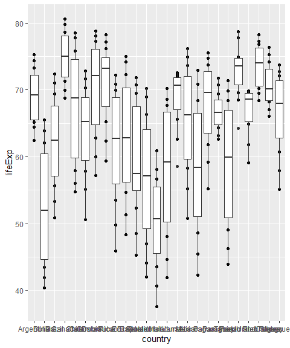<!-- -->

```r
gapminder %>% 
  filter(continent == "Americas") %>% #have to switch x and y variables compared to above
  ggplot(aes(lifeExp, country)) + 
  ggridges::geom_density_ridges()
```

```
## Picking joint bandwidth of 3.63
```

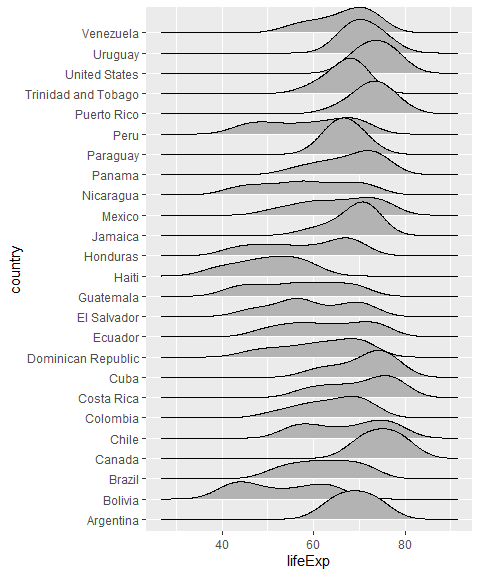<!-- -->

## Exercise 6: Bar plot madness

### 6(a) Colour and stacking madness

- Change the following plot so that it shows _proportion_ on the y-axis, not count.
- Change the x-axis so that it doesn't appear to be continuous.
- Put the bars for transmission side-by-side with their own colour.
- Capitalize the legend title.


```r
mtcars %>% 
  mutate(transmission = if_else(am == 0, "automatic", "manual")) %>% 
  ggplot(aes(cyl)) +
  geom_bar(aes(colour = transmission))
```

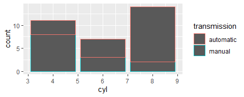<!-- -->

### 6(b) Bar heights already calculated

Here's the number of people having a certain hair colour from a sample of 592 people:


```r
(hair <- as_tibble(HairEyeColor) %>% 
  count(Hair, wt = n))
```

```
## # A tibble: 4 x 2
##   Hair      n
##   <chr> <dbl>
## 1 Black   108
## 2 Blond   127
## 3 Brown   286
## 4 Red      71
```

Fix the following bar plot so that it shows these counts.


```r
ggplot(hair, aes(Hair, n)) +
  geom_col()
```

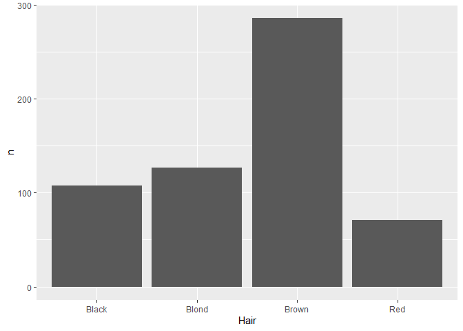<!-- -->

## Exercise 7: Tiling

Here's the number of people having a certain hair and eye colour from a sample of 592 people:


```r
(hair_eye <- as_tibble(HairEyeColor) %>% 
  count(Hair, Eye, wt = n))
```

```
## # A tibble: 16 x 3
##    Hair  Eye       n
##    <chr> <chr> <dbl>
##  1 Black Blue     20
##  2 Black Brown    68
##  3 Black Green     5
##  4 Black Hazel    15
##  5 Blond Blue     94
##  6 Blond Brown     7
##  7 Blond Green    16
##  8 Blond Hazel    10
##  9 Brown Blue     84
## 10 Brown Brown   119
## 11 Brown Green    29
## 12 Brown Hazel    54
## 13 Red   Blue     17
## 14 Red   Brown    26
## 15 Red   Green    14
## 16 Red   Hazel    14
```

Fix the following plot so that it shows a filled-in square for each combination. 


```r
ggplot(hair_eye, aes(Hair, Eye)) +
  geom_point(aes(colour = n))
```

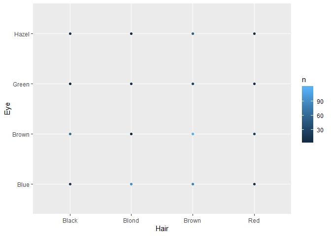<!-- -->

By the way, `geom_count()` is like `geom_bar()`: it counts the number of overlapping points.


## Additional take-home practice

If you'd like some practice, give these exercises a try

__Exercise 1__: Make a plot of `year` (x) vs `lifeExp` (y), with points coloured by continent. Then, to that same plot, fit a straight regression line to each continent, without the error bars. If you can, try piping the data frame into the `ggplot()` function.

__Exercise 2__: Repeat Exercise 1, but switch the _regression line_ and _geom\_point_ layers. How is this plot different from that of Exercise 1?

__Exercise 3__: Omit the `geom_point()` layer from either of the above two plots (it doesn't matter which). Does the line still show up, even though the data aren't shown? Why or why not?

__Exercise 4__: Make a plot of `year` (x) vs `lifeExp` (y), facetted by continent. Then, fit a smoother through the data for each continent, without the error bars. Choose a span that you feel is appropriate.

__Exercise 5__: Plot the population over time (year) using lines, so that each country has its own line. Colour by `gdpPercap`. Add alpha transparency to your liking. 

__Exercise 6__: Add points to the plot in Exercise 5.
